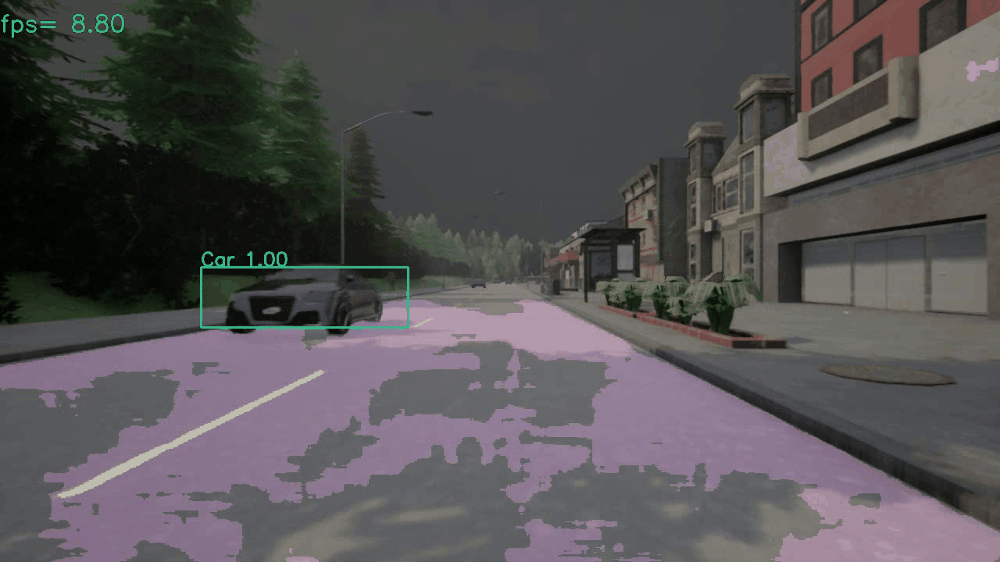

# YOLOP

My unofficial reimplement of yolop

## Result



## Requirement

```
pip install  requirements.txt
```

## Data Preparation

Refer to Carla-dataset-generator https://github.com/SekiroRong/Carla_dataset_generator

## Contact

If you think this work is useful, please give me a star!  
If you find any errors or have any suggestions, please contact me (**Email:** `sekirorong@gmail.com`).  
Thank you!

## Reference

1. [GitHub - bubbliiiing/yolov4-pytorch: 这是一个YoloV4-pytorch的源码，可以用于训练自己的模型。](https://github.com/bubbliiiing/yolov4-pytorch)

2. YOLOP: You Only Look Once for Panoptic Driving Perception](https://arxiv.org/abs/2108.11250)

## TODO

- [ ] Support Kitti dataset
